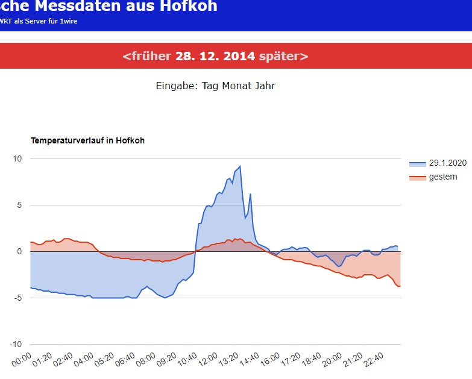

# OpenWRT on WR703N and weatherstation

After having upgraded some of my routers with OpenWRT and ddwrt I learned more about the general possibilities as a cheap WiFi linux machine. A friend of mine had started to measure the temperature in his sauna with OneWire DS18B20 and I was experiencing the cold winters in Lower Saxony, wondering how could it would get every night. That's the inspiration!

## Weatherstation

By November 23rd, 2013 the system was up and running. It took a little while to push the data to the internet, but the database contains daily files from 20141212 to 20160728. The [documentation](temp.hofkoh.de/info.pdf) was written 1. April 2015.

