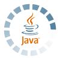

# Programming History
Short documentation of programming projects

Over the years I used a handful of programming languages. Here are a few examples for personal documentation.

## 2020

 

First use of Kotlin with T400 remote project.

## 2019

Started with Jupyter notebook with my students. This includes Markdown, LaTeX, TeX and Python3. Organized with Anaconda. And I started Micropython for the robot projects.

## 2018

The BeTogetherConference in November 2018 inspired me to write the first lines in Python - and document it in [python2018 repository](https://github.com/kreier/python2018).

## 2016

Tried different linux distrubutions and companies for our school network at the International German School Ho Chi Minh City, from [iServ](https://de.wikipedia.org/wiki/IServ) to [UCS Univention Corporate Server](https://en.wikipedia.org/wiki/Univention_Corporate_Server). In the end we just signed up for Google services as a non-profit organisation, use their cloud and that's it.

## 2015

Start of Arduino. From stepper motor to pressure sensor in vacuum.

## 2013

Weather station on a WR703N with OpenWRT initiated, collecting data until 2016 when I moved to Vietnam.

## 2008

AR65view is finalized and uploaded to Sourceforge. Now using version control with SVN.

## 2007

 

The Java project [ar65view](https://github.com/kreier/ar65view) was started and uses Swing GUI elements for data analysis at the Humboldt University to Berlin.

## 2000

To solve some problems of my physics study I returned to C and expanded to C++ with some simple coding.

## 1999

Writing my first webpage [saiht.de](http://saiht.de) I started to use HTML.

## 1997

VBA or [Visual Basic for Applications](https://en.wikipedia.org/wiki/Visual_Basic_for_Applications), used in Excel to import and analyse data files. The commands were translated into german and internally used with the english names, so we could use english VBA programs as well. This additional layer caused some compatibility issues during these years and was eventually abandoned.

## 1992

Some TurboPascal at school on 386DX and 486 SX. The gymnasium had not yet been named, but is called now Lise-Meitner-Gymnasium.

## 1991

With my new Atari STFM520 I started Omicron Basic and Lattice C. The latter one was supposed to be fast, developed by a british company, but proved to be inferiour and slower in math calculations than the Basic interpreter. It took another 10 years until I touched C again.

Can't find the files of my Adventure game I programmed back then in Basic. Jan and Dennis tried to solve it, though.

## 1988

Some Basic programming on my [ZX81](https://en.wikipedia.org/wiki/ZX81) - gift from my cousin, extended with 16 kByte from an astronomer down the street. I got a C64 keyboard and resoldered it to fit my ZX81.

## 1987

The department of education provided us some [KC85/3](https://en.wikipedia.org/wiki/KC_85) in the Haus am Anger and our Math teacher Herr Klötzer dedicated some time after school for us to learn the first lines of code.
